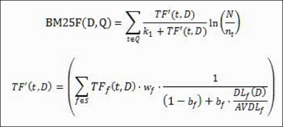

# **MIDSEARCH: The Middest Search Engine of Them All**

MidSearch is my attempt at building a search engine entirely in Java, piggybacking off of Apache Nutch's output (formatted as a dump file).
It is built with no external libraries beyond Apache Nutch. 

It aims to lower RAM usage by mainly storing data in a binary storage format, reducing the need to keep the entire index in memory.
This also improves search performance by using an **O(w * (log(n) + m) + (wm) * log(wm))** index design and lookup algorithm, **n** being the total amount of unique terms, **m** being the number of URLs chosen to be outputted (generally being a low number, 10 by default), and **w** being the amount of words in the query.

## Architecture:
MidSearch is built with a pipeline architecture, where each main step of the pipeline is included in the same directory. It processes crawl data through multiple stages
including parsing, ranking, and conversion to binary. 

### Steps:
**Parsing:** This is the process of turning the Apache Nutch output into something the rest of the pipeline can use. This has two main goals:
1. Build the general parse dump: Link each unique URL with a URLID (an integer identifier for that URL only), and its ParseText, being the extracted text outputted from Nutch.
2. Prepare the link graph data for PageRank: There are 3 files used in this: A raw list of each unique URL, a file containing every outlink associated with a URL, and a hash table mapping each URLID to the location of its corresponding outlink entry.

**Ranking:** This converts the parsed data into a classic inverted index, associating each term with every URL under it, and associating each URL with a score for that term. The score has two components:
1. BM25: Calculates how relevant a document is to a query based off of this formula: 
2. PageRank: Creates a directed, weighted graph where each URL receives a score based on incoming links and the PageRank scores of the pages linking to it. This calculation is repeated 45 times, but the iteration count can be adjusted.

**Binary Conversion:** This essentially converts the given ranking into binary, split into 3 groups:
1. Lexicon: This pairs each term with its list of URLs. The list of URLs is sorted by score, and the lexicon is sorted in lexicographic order.
2. Docs: Like the raw list of unique URLs from the parsing stage, this is a list of each unique URL, this time in binary format.
3. Header: This is a hash table mapping each URLID with its score and offset to the Docs file.


## Dependencies:
**Java version 26.0 or above.**

**A directory titled "nutch-out" in the root directory, containing Nutch's crawl data in a list of dump files.**
The "nutch-out" directory MUST be formatted as follows:
```
nutch-out/
├── out1/
│   └── dump
├── out2/
│   └── dump
└── ...
```


## Setup
1. Place the Apache Nutch crawl output in "nutch-out/".
2. Compile all the files in "src/".
3. Run `bin/main_executables/BuildDatabase`

## Usage
Run `bin/main_executables/SimpleImplementation` and type a query. Do note that you must run the .class file again for each query.

## Example

Query: 
computer science

Output: 
```
URL:: https://en.wikipedia.org/wiki/Computer_science
URLID:: 460744
SCORE:: 6.746006272412061

Found 1 URLS in 8 milliseconds
```

## Notes
This is a passion project so I most likely will not update this until much later on. 
